# FUTURE FESTS
Bienvenido a FutureFests, tu portal de referencia para descubrir los eventos tecnológicos más importantes que tienen lugar cada mes. Nuestro objetivo es conectar a entusiastas profesionales y empresas del sector tecnológico con eventos que abordan las últimas tendencias y avances en tecnología, desde conferencias y seminarios, hasta talleres y ferias.

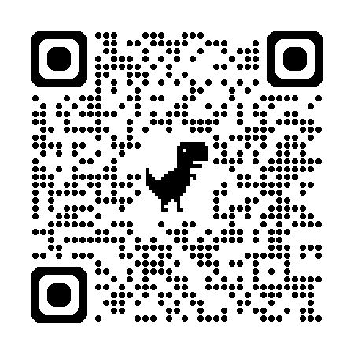
## ¿Que Ofrecemos?
##### 1. Amplia variedad de eventos.
En FutureFests, encontrarás una extensa lista de eventos tecnológicos.
##### 2. Interfaz intuitiva.
Nuestra plataforma está diseñada para ser intuitiva y fácil de usar. Podrás buscar eventos por nombre o palabras que lo integren, lo que te permitirá encontrar rápidamente los que más te interesen.
##### 3. Detalles completos de los eventos.
Cada evento listado en Future Fest viene con una descripción detallada, fechas y enlace para más información. Esto te asegura tener toda la información necesaria para decidir a qué eventos asistir.
##### 4. Alternativa de elegir tus eventos favoritos.
Pero no solo eso. Si creas una cuenta con nosotros podrás guardar tus eventos favoritos. Nunca te perderás un evento importante nuevamente. Por supuesto, si ya han pasado o has cambiado de opinión, podrás eliminarlos.
## ¿Por qué Future Fests?
El mundo tecnológico cambia a velocidad de vértigo y nosotros queremos ser tu guía en esta emocionante realidad. Future Fests está aquí para ayudarte a aprovechar al máximo todas las oportunidades que este tipo de eventos ofrece, conectándote con la comunidad tecnológica local e internacional.
Únete a Future Fests hoy y descubre cómo puedes ser parte del futuro tecnológico. ¡Explora, conecta y crece con nosotros!
## Informacion tecnica
### Tecnologias y herramientas usadas
- NODE JS.
- EXPRESS.
- MONGODB.
- POSTGRE SQL.
- API REST.
- AUTENTICACIÓN CON JWT USER+PASSWORD.
- AUTENTICACIÓN CON PASSPORT GOOGLE.
- MVC.
- MOBILE FIRST.
- DESPLIEGUE EN RENDER.
- WEB SCRAPING (PUPPETEER)
- TRELLO.
- GITHUB.
- MORGAN.
- SWAGGER.
- JSDOC.
### Mobile First
Puesto que en la actualidad es tan importante, el uso de los aplicativos en móviles, nuestra aplicación se adapta a los diferentes tamaños de pantalla, tanto para pantallas de móviles, como de ordenadores de sobremesa, como podemos observar en las siguientes imágenes:
- **Vista iPad**:
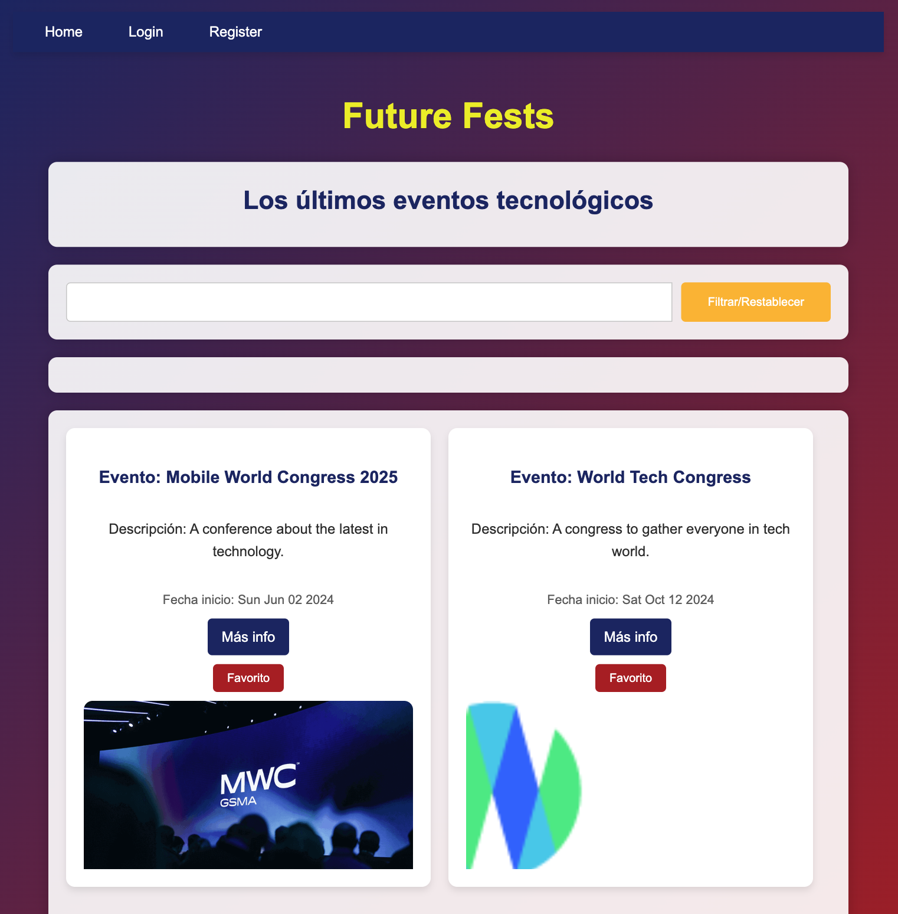
- **Vista movil**:
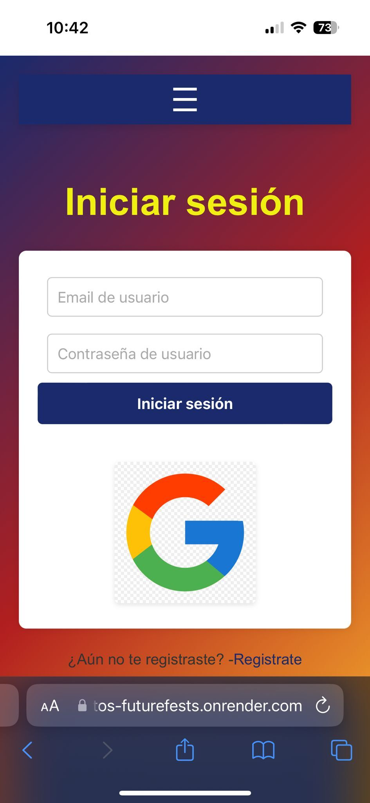
- **Vista Desktop**:
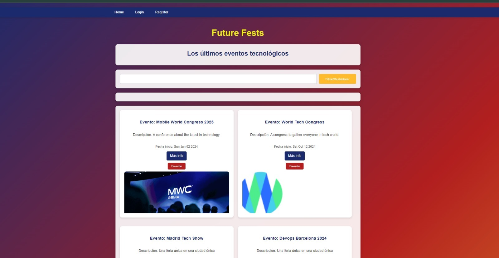
### Objetivos
✅ Bases de datos y app desplegadas en Render y MongoDB Atlas.

✅ Se implementó la autenticacion con email/password y con Passport Google.

✅ Se implementaron middlewares para controlar el acceso a rutas privadas.

✅ Se realizó correctamente el scraping de dos páginas.

✅ Se implementó un menú hamburguesa.

✅ Se trabajó con diferentes vistas en formato Pug.

✅ Se utilizó adecuadamente el modelo Vista-Controlador.

✅ Se implementó el uso de JSDOC para la la documentación.

✅ Se consiguió una vista mobile First.

✅ Se logró un trabajo ordenado gracias a la puesta en marcha de una metodología ágil (Scrum, Trello).

✅ Se gestionó de manera correcta el uso de ramas en GitHub.
### Organización
#### Manejo de ramas GitHub
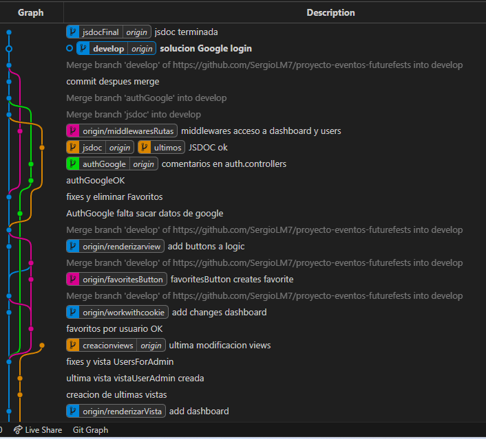
#### Manejo de Trello
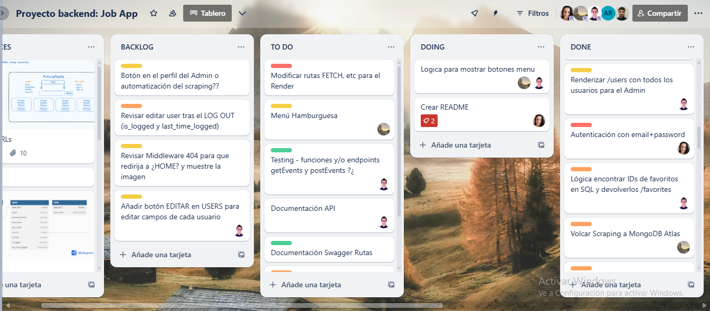
### Diseño de Producto
#### Vista panel  de administrador
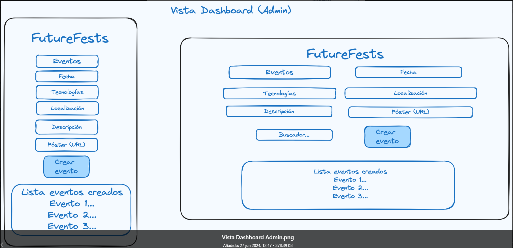
#### Vista favoritos
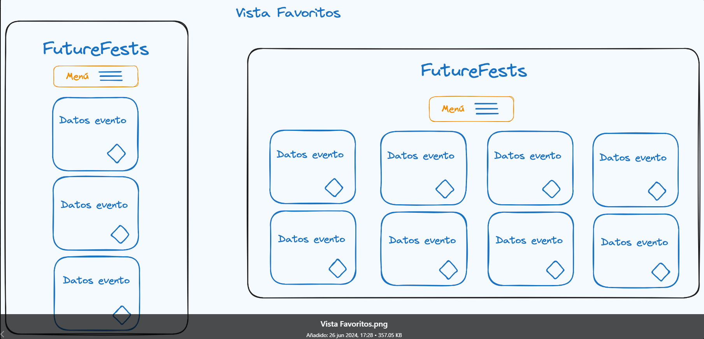
#### Vista home administrador
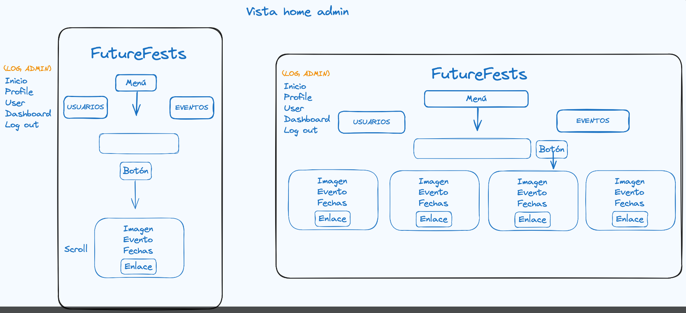
#### Vista home usuarios
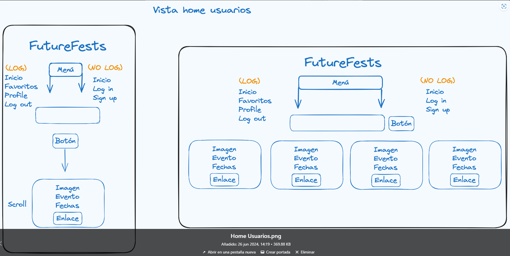
#### Vista iniciar sesion
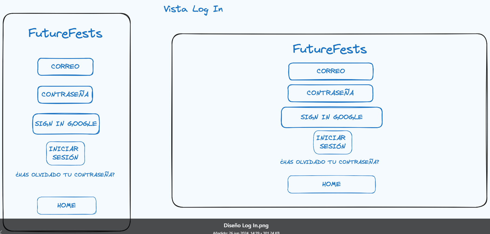
#### Vista perfil
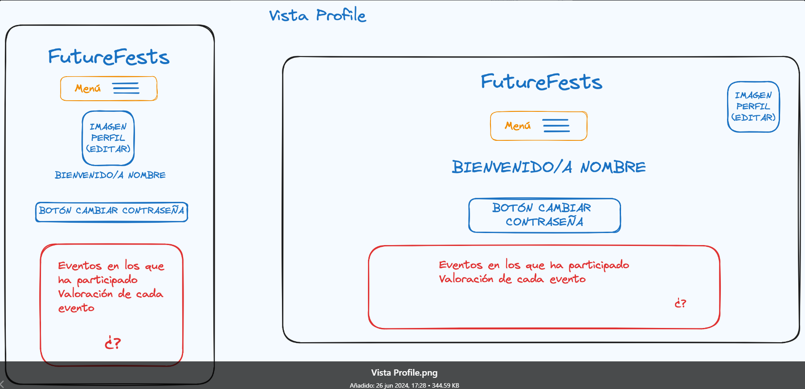
#### Vista registro
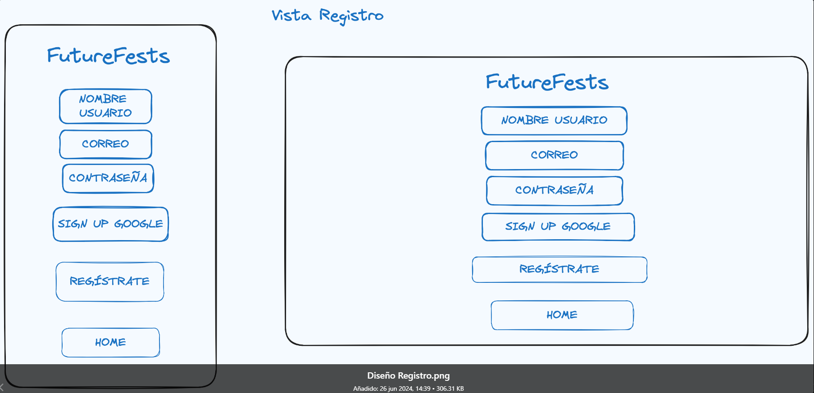
#### Vista de usuarios por administrador
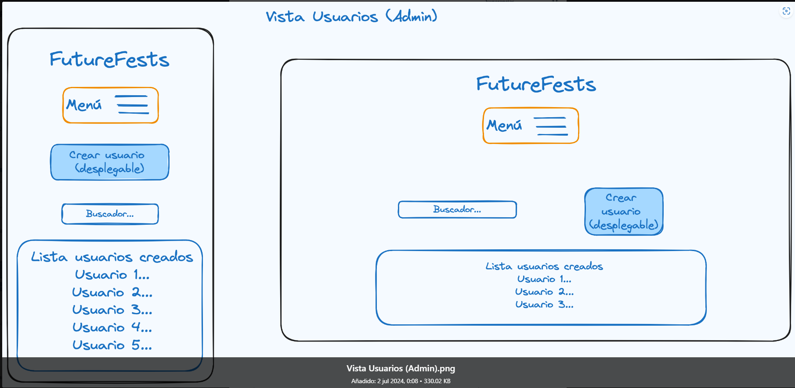
### Uso
1. [Ingresa aqui para enterarte de los mejores eventos](https://proyecto-eventos-futurefests.onrender.com)
2. Regístrate o inicia sesión.
3. Comienza el revisar los eventos que te ofrecemos.
4. Marca como favoritas las que te interecen y no te pierdas de ninguno.
### Estructura del proyecto
- **Config/**: Configuración de la aplicación.
- **Controllers/**: Lógica de negocio y manejo de solicitudes.
- **Middlewares/**: Funciones intermedias para procesar solicitudes y respuestas.
- **Models/**: Definición de estructuras de datos y lógica de base de datos.
- **Public/**: Archivos estáticos servidos al cliente.
- **Queries/**: Consultas a la base de datos.
- **Routes/**: Definición de rutas de la API.
- **Services/**: Lógica de negocio y servicios auxiliares.
- **Utils/**: Funciones utilitarias y helpers.
- **Validators/**: Validación de datos de entrada.
- **Views/**: Plantillas Pug.
- **index.js**: Punto de entrada y configuración inicial de la aplicación.
### Documentación
- **JSDOCs**: [Documentación de funciones](https://proyecto-eventos-futurefests.onrender.com/api-jsdoc/)
- **Swagger**: [Documentación de rutas](http://localhost:3000/api-docs/)
### Contribución
Si deseas contribuir a este proyecto, por favor sigue los siguientes pasos:
- Haz un fork del repositorio.
- Crea una nueva rama (git checkout -b nueva-rama).
- Realiza tus cambios y haz commit (git commit -am 'Agrega nueva característica').
- Sube tus cambios a la rama (git push origin nueva-característica).
- Abre un Pull Request.
### Colaboradores
Los colaboradores de este proyecto somos Luis Carlos Acosta, Sergio Lillo y Stephani Damiani, estudiantes de Full Stack TheBridge.
- [Luis Carlos Acosta GitHub](https://github.com/luiscacostas)
- [Sergio Lillo GitHub](https://github.com/SergioLM7)
- [Stephani Damiani  GitHub](https://github.com/steph-d989)
