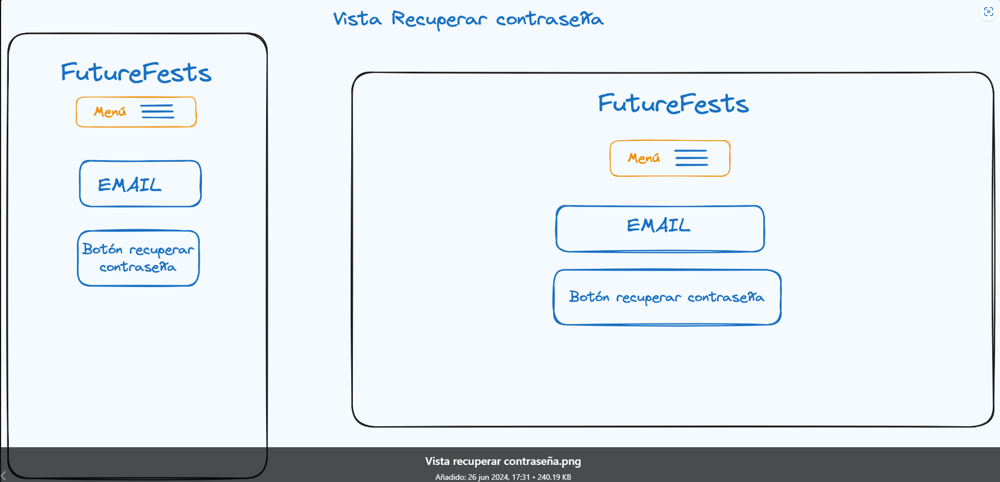

# FUTURE FESTS

Bienvenido a FutureFest, tu portal de referencia para descubrir los eventos tecnológicos más importantes que tienen lugar en Madrid. Nuestro objetivo es conectar a entusiastas profesionales y empresas del sector tecnológico con eventos que abordan las últimas tendencias y avances en tecnología, desde conferencias y seminarios hasta talleres y ferias.

## ¿Que Ofrecemos?

##### 1. Amplia variedad de Eventos.

En FutureFest, encontrarás una extensa lista de eventos tecnológicos que se realizan en Madrid. 

##### 2. Interfaz intuitiva.

Nuestra plataforma está diseñada para ser intuitiva y fácil de usar. Podrás buscar eventos por nombre y palabra clave, lo que te permitirá encontrar rápidamente los eventos que más te interesan.

##### 3. Detalles completos de los eventos.

Cada evento listado en FutureFest viene con una descripción detallada, información sobre los ponentes, horarios, ubicación, y cómo registrarse. Esto te asegura tener toda la información necesaria para decidir a qué eventos asistir.

##### 4. Alternativa de elegir tus eventos favoritos.

Crea una lista de tus eventos favoritos. Nunca te perderás un evento importante nuevamente.

## ¿Por Qué FutureFest?

Madrid se está posicionando como un hub tecnológico en Europa, y nosotros queremos ser tu guía en este emocionante ecosistema. FutureFest está aquí para ayudarte a aprovechar al máximo todas las oportunidades que la ciudad ofrece, conectándote con la comunidad tecnológica local e internacional.

Únete a FutureFest hoy y descubre cómo puedes ser parte del futuro tecnológico de Madrid. ¡Explora, conecta y crece con nosotros!

## Informacion tecnica

### Tecnologias usadas

- TRELLO.
- GITHUB.
- TEST UNITARIO JEST.
- MOBILE FIRST.
- MORGAN.
- SWAGGER.
- JSDOC.
- DESPLIEGUE EN RENDER.
- WEB SCRAPING.
- EXPRESS.
- MONGODB.
- POSTGRE SQL.
- MVC.
- API REST.
- AUTENTICACIÓN CON JWT USER+PASSWORD.
- AUTENTICACIÓN CON GOOGLE.

### Mobile First

Puesto que en la actualidad es tan importante, el uso de los aplicativos en móviles, nuestra aplicación se adapta a los diferentes tamaños de pantalla tanto para pantallas de móviles como de ordenadores de sobre mesa, como podemos observar en las siguientes imágenes:

- **Vista movil**:

- **Vista IPad**:

- **Vista Desktop**:

### Objetivos

✔️ Se logró un trabajo ordenado gracias al uso de Trello. 

✔️ Se trabajó de manera correcta por el uso de ramas en GitHub. 

✔️ Se logró una vista mobile First. 

✔️ Se trabajo con las rutas.

✔️ Se implementaron Middlewares como morgan. 

✔️ Se implementó el uso de JSDOC para la la documentación. 

✔️ Proyecto desplegado en render y MongoDB Atlas.

✔️ Se realizó correctamente el scraping. 

✔️ Se implementó la autenticacion con correo y password.

✔️ Se implementó la autenticación con Google.

### Organización

#### Manejo de ramas GitHub

#### Manejo de Trello

### Diseño de Producto

#### Vista panel  de administrador

#### Vista favoritos

#### Vista home administrador

#### Vista home usuarios

#### Vista iniciar sesion

#### Vista perfil

#### Vista recuperar contraseña

#### Vista registro

#### Vista de usuarios por administrador

### Uso

1. [Ingresa aqui para enterarte de los mejores eventos](https://proyecto-eventos-futurefests.onrender.com)
2. Regístrate o inicia sesión.
3. Comienza el revisar los eventos que te ofrecemos.
4. Marca como favoritas las que te interecen y no te pierdas de ninguno.

### Estructura del proyecto

- **Config/**: Configuración de la aplicación.
- **Controllers/**: Lógica de negocio y manejo de solicitudes.
- **Middlewares/**: Funciones intermedias para procesar solicitudes y respuestas.
- **Models/**: Definición de estructuras de datos y lógica de base de datos.
- **Public/**: Archivos estáticos servidos al cliente.
- **Queries/**: Consultas a la base de datos.
- **Routes/**: Definición de rutas de la API.
- **Services/**: Lógica de negocio y servicios auxiliares.
- **Utils/**: Funciones utilitarias y helpers.
- **Validators/**: Validación de datos de entrada.
- **Views/**: Plantillas Pug.
- **index.js**: Punto de entrada y configuración inicial de la aplicación.

### Contribución

Si deseas contribuir a este proyecto, por favor sigue los siguientes pasos:

- Haz un fork del repositorio.
- Crea una nueva rama (git checkout -b nueva-rama).
- Realiza tus cambios y haz commit (git commit -am 'Agrega nueva característica').
- Sube tus cambios a la rama (git push origin nueva-característica).
- Abre un Pull Request.

### Colaboradores

Los colaboradores de este proyecto somos Luis Carlos Acosta, Sergio Lillo y Stephani Damiani, estudiantes de Full Stack TheBridge.

- [Luis Carlos Acosta GitHub](https://github.com/luiscacostas)
- [Sergio Lillo GitHub](https://github.com/SergioLM7)
- [Stephani Damiani  GitHub](https://github.com/steph-d989)